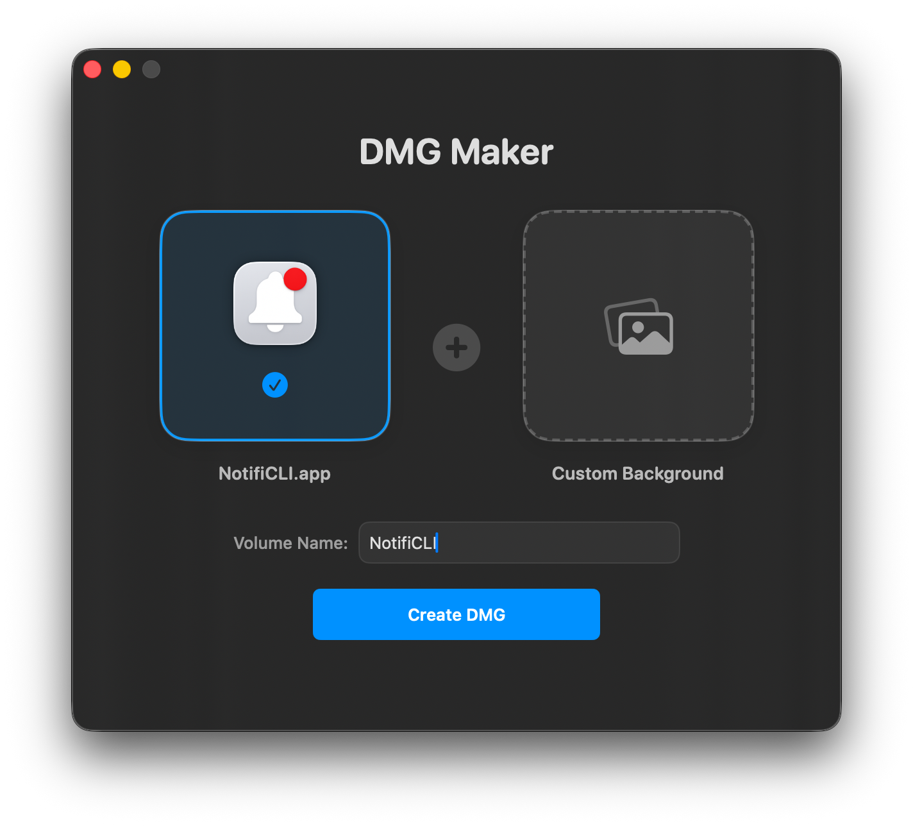
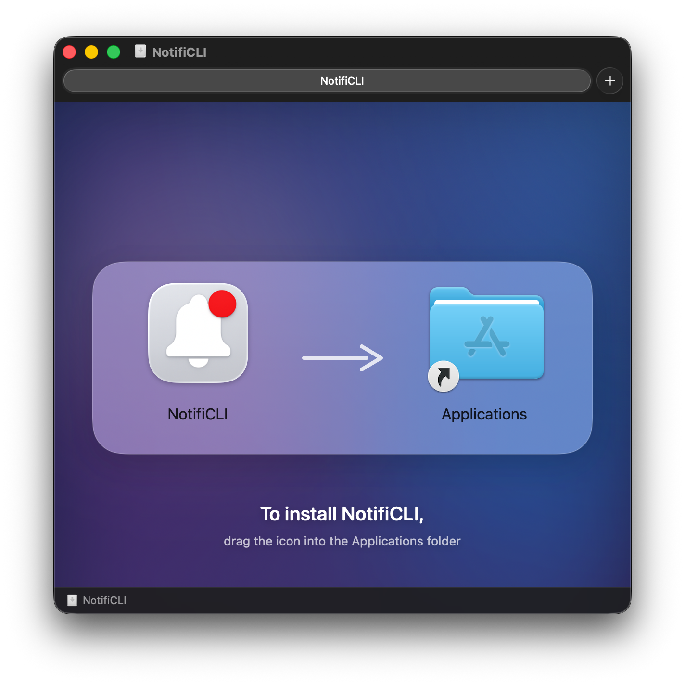

# DMGMaker 🚀

|  |  |
| :---: | :---: |

A premium macOS DMG creation tool with live-rendered SwiftUI backgrounds, glassmorphism, and Retina support.

## Features

- **Live Mesh Gradients**: Professional backgrounds rendered on-the-fly using SwiftUI.
- **Glassmorphic UI**: Instruction area with native macOS "frosted glass" effects.
- **Retina Ready**: All assets and backgrounds are rendered at 2x scale for sharp displays.
- **"No-Halo" Applications Link**: Uses specialized naming tricks to prevent ugly dashed boxes in Finder.
- **CLI Support**: Headless creation for build pipelines.

## Usage

### GUI Mode
Simply run the app and drag your `.app` bundle and an optional background onto the drop zones.

### CLI Mode (New! ✨)
Generate consistent, high-quality DMGs directly from your terminal or build scripts:

```bash
swift run DMGMaker --app "/path/to/Your.app" --name "Volume Name"
```

The resulting DMG will be placed in the same directory as your input `.app` bundle.

## Technical Details

- **Portability**: Uses internal Bundle resources for all icons and assets.
- **Engine**: Wrapper around the established `create-dmg` utility, but with significantly enhanced visual rendering.
- **Requirements**: macOS 14+ and `create-dmg` installed via Homebrew.
