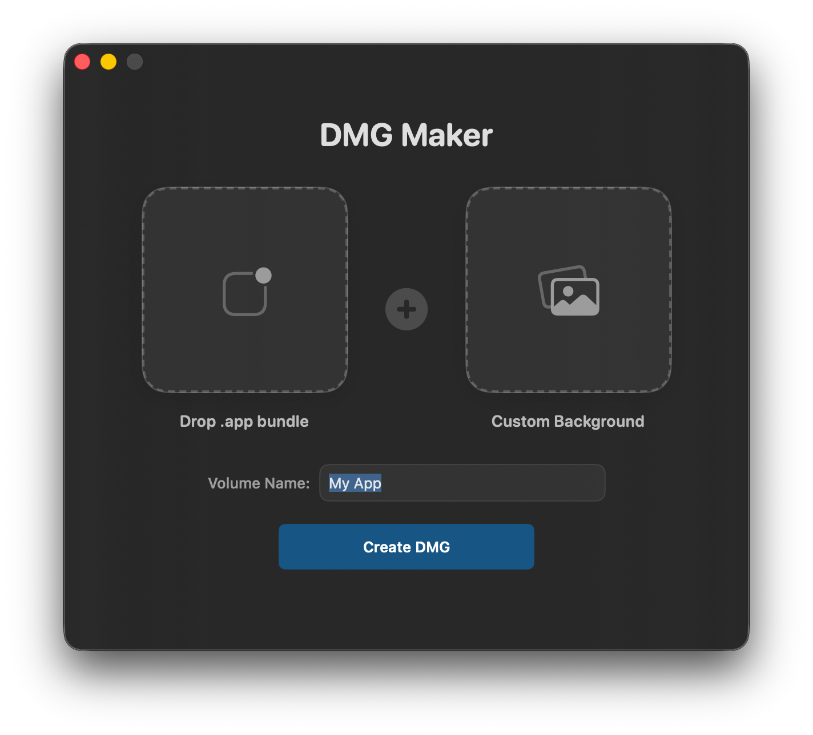
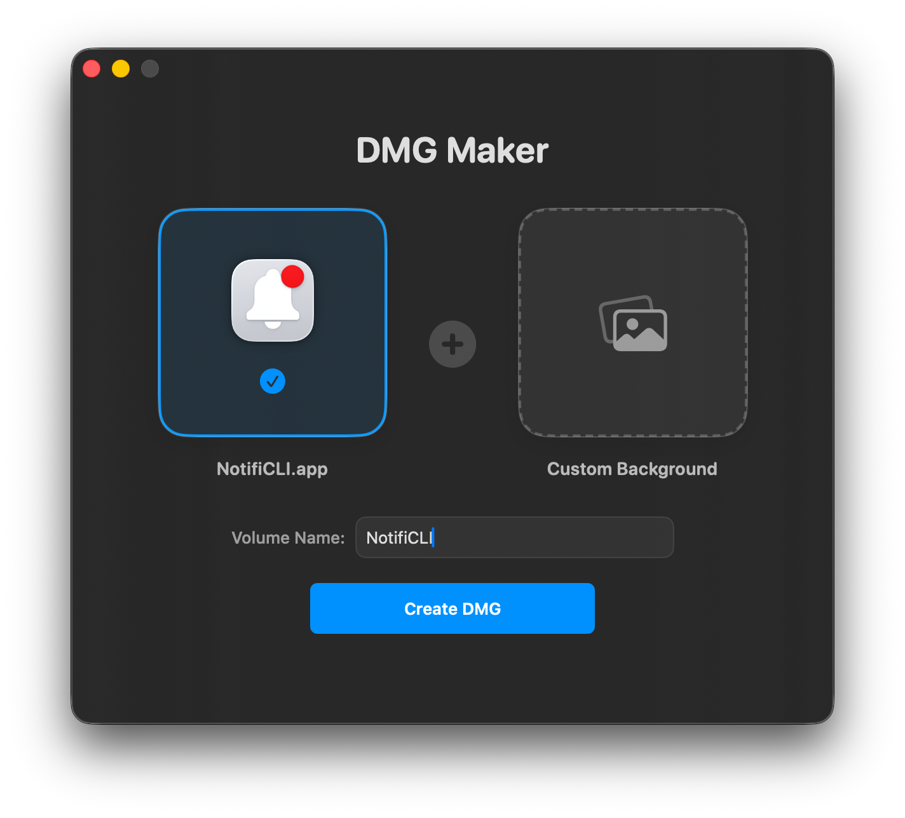
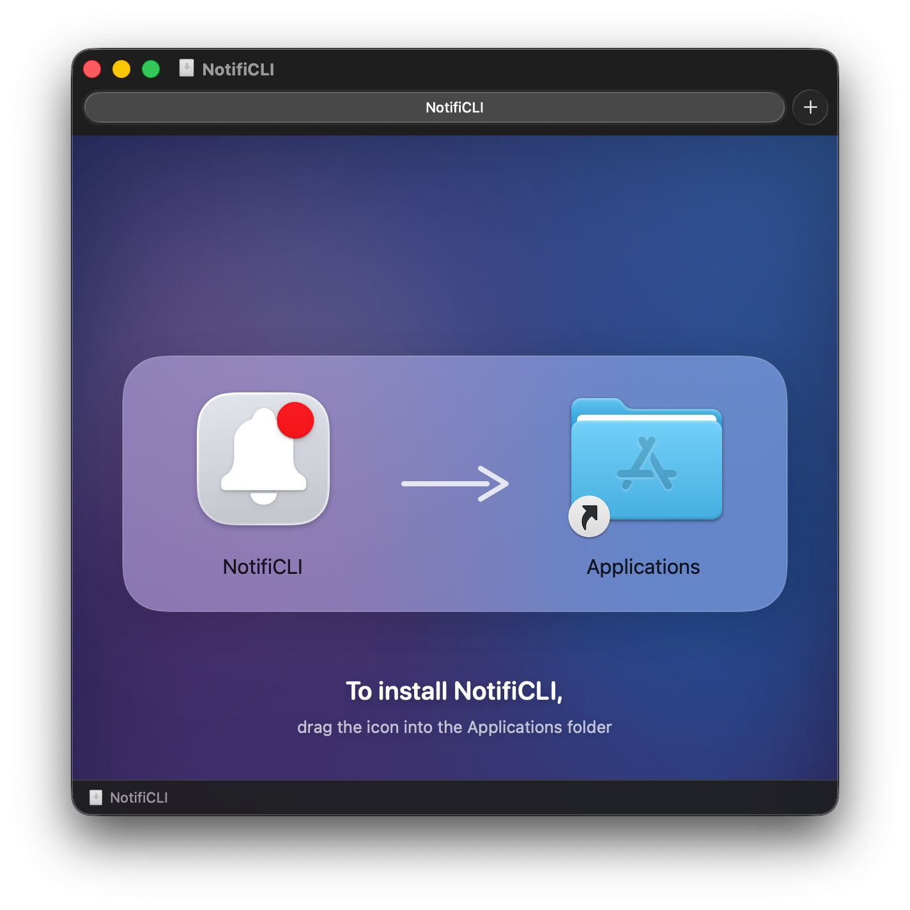

# DMG Maker

<p align="center">
  
  
  
</p>

A premium macOS DMG creation tool with live-rendered SwiftUI backgrounds, glassmorphism, and Retina support.

## Features

- **Live Mesh Gradients**: Professional backgrounds rendered on-the-fly using SwiftUI.
- **Glassmorphic UI**: Instruction area with native macOS "frosted glass" effects.
- **Retina Ready**: All assets and backgrounds are rendered at 2x scale for sharp displays.
- **"No-Halo" Applications Link**: Uses specialized naming tricks to prevent ugly dashed boxes in Finder.
- **CLI Support**: Headless creation for build pipelines.

## Usage

### GUI Mode
Simply run the app and drag your `.app` bundle onto the primary drop zone.

**Quick Start:**
1. **Drop your .app bundle** into the first zone.
2. **(Optional) Drop a custom background** into the second zone. If you don't, DMG Maker will generate a beautiful mesh-gradient background for you automatically!
3. **Enter the Volume Name** and click **Create DMG**.

### CLI Mode
Generate consistent, high-quality DMGs directly from your terminal or build scripts:

```bash
swift run "DMG Maker" --app "/path/to/Your.app" --name "Volume Name"
```

The resulting DMG will be placed in the same directory as your input `.app` bundle.

## Technical Details

- **Requirements**: macOS 14+.
## Installation

1. **Download `DMGMaker.dmg`** from [Releases](https://github.com/saihgupr/DMGMaker/releases)
2. Open the DMG and drag **`DMG Maker.app`** to your **Applications** folder
3. **Fix the security warning** - on macOS Sequoia/Tahoe, double-clicking the app shows *"Apple could not verify..."* with no "Open Anyway" button. Use one of these fixes:
   - **Easy**: Double-click **`Fix Security.command`** (included in the DMG) -> Terminal opens, runs the fix, confirms with a dialog. *(macOS may ask permission to run it - click Allow.)*
   - **Terminal**: `xattr -cr /Applications/DMG\ Maker.app`
4. Open **`DMG Maker.app`** normally.

## Security & Gatekeeper (macOS)

DMG Maker is not signed with a paid Apple Developer certificate. On macOS Sequoia and Tahoe, this means the app shows **only "Move to Trash"** when first launched - the "Open Anyway" button no longer appears in the dialog.

**The fix is a one-liner:**
```bash
xattr -cr /Applications/DMG\ Maker.app
```

Or use the **`Fix Security.command`** included in the DMG - just double-click it after dragging the app to Applications.

## Support

If you find DMGMaker useful, please consider:
- **Starring the repo** to help others discover it.
- **[Buying me a coffee](https://ko-fi.com/saihgupr)** to support further development.

Your support helps keep this project free and open-source!
